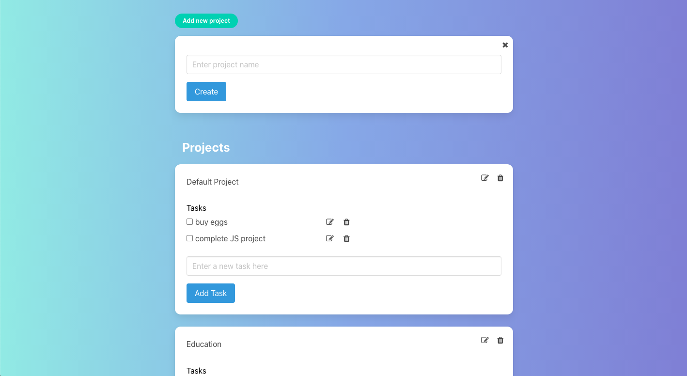

# JS TODO List

> A simple TODO-list app built to practice Javascript and Webpack

 - todos are dynamically created objects
 - tasks include proposed properties
 - todos can be divided by projects
 - object and DOM logic are separate
 - user can view projects, view todos in projects, expand tasks to see details, projects and todos have CRUD functionality

## Built With

- HTML
- Javascript
- Sass
- [Bulma.io](https://bulma.io)

## Getting Started

To get a local copy up and running follow these simple example steps.

### Setup

1.  Clone this repository with
    `git clone https://github.com/Haroonabdulrazaq/js-todo-list.git` using your terminal or command line.
2.  Change to the project directory by entering `cd js-todo-list` in the terminal
3.  Next open the folder with an IDE like VSCode.
4.  Install the LiveServer Extension on VSCode.
5.  Once installed hit the "Go Live" button on the bottom right hand of your editor.
6.  The application should automatically open in a browser window.

## Authors

👤 **Haroon Abdulrazaq**

- Github: [@haroonabdulrazaq](https://github.com/Haroonabdulrazaq)
- Twitter: [@Hanq_o](https://twitter.com/Hanq_o)
- Linkedin: [Haroonabdulrazaq](https://www.linkedin.com/in/haroonabdulrazaq)

👤 **Mark Rode**

- Github: [@m15e](https://github.com/m15e)

## Show your support

Give a ⭐️ if you like this project!

## Acknowledgments

- Microverse
- The Odin Project

## 📝 License

This project is [MIT](lic.url) licensed.